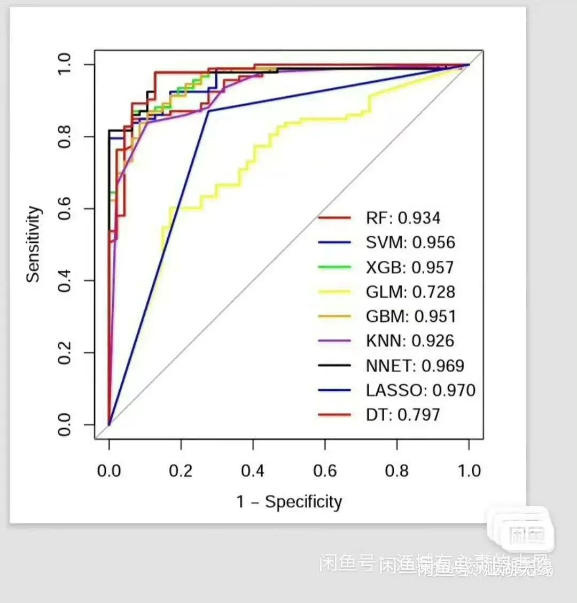
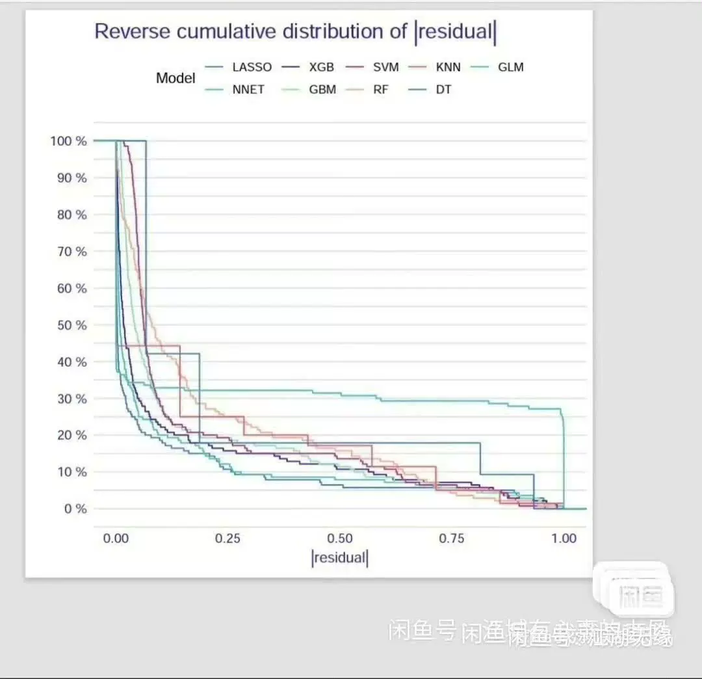
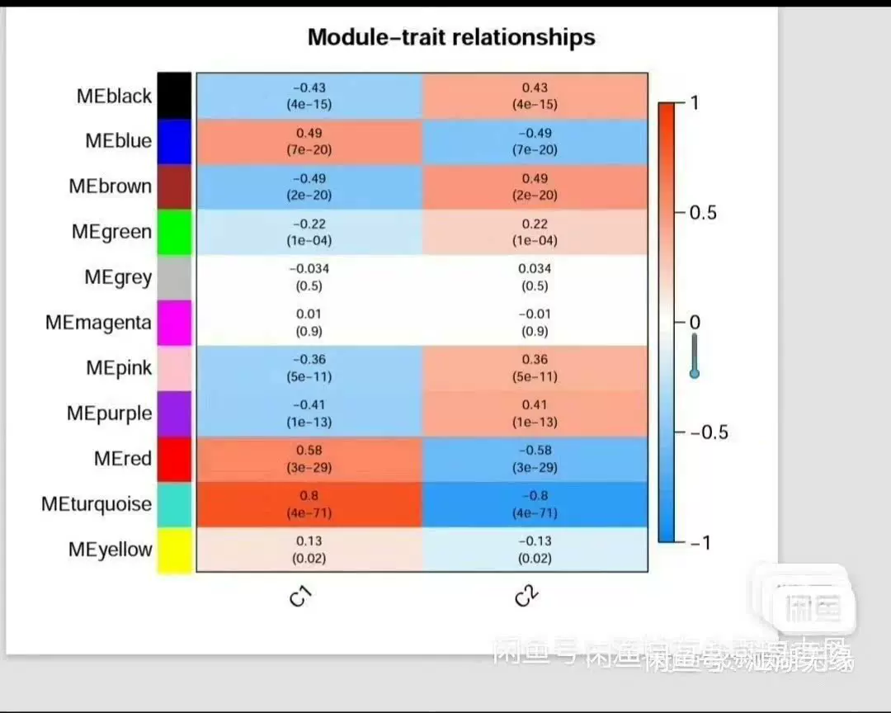
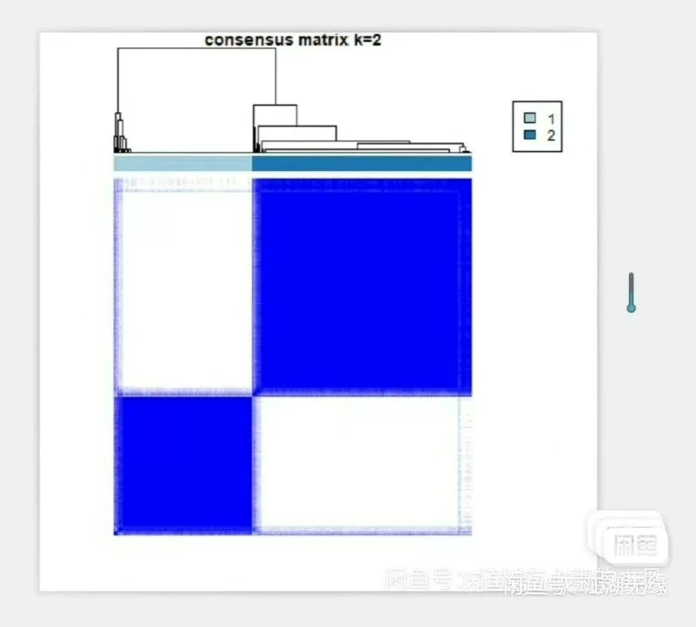
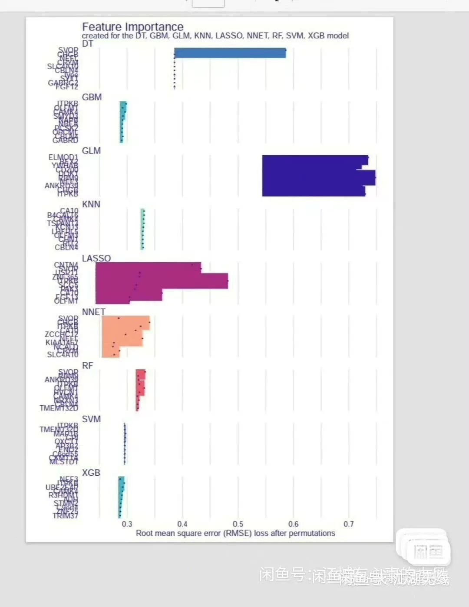
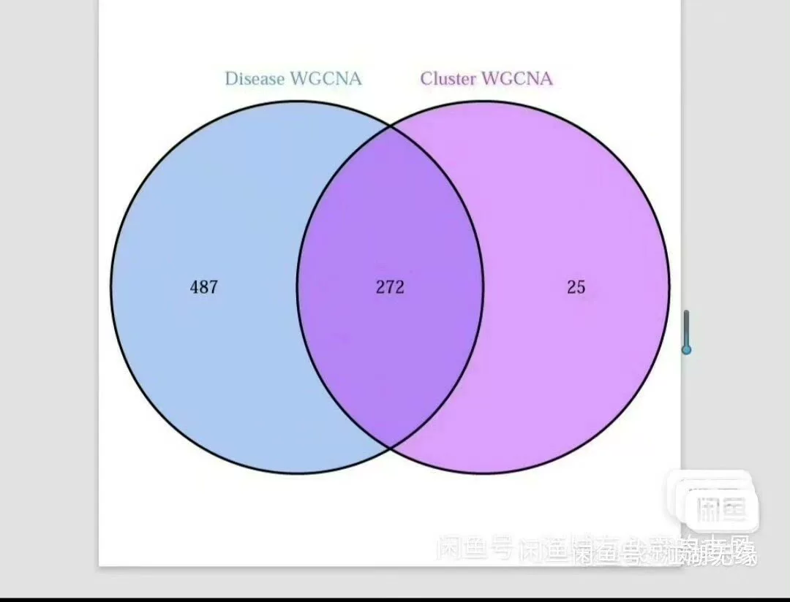
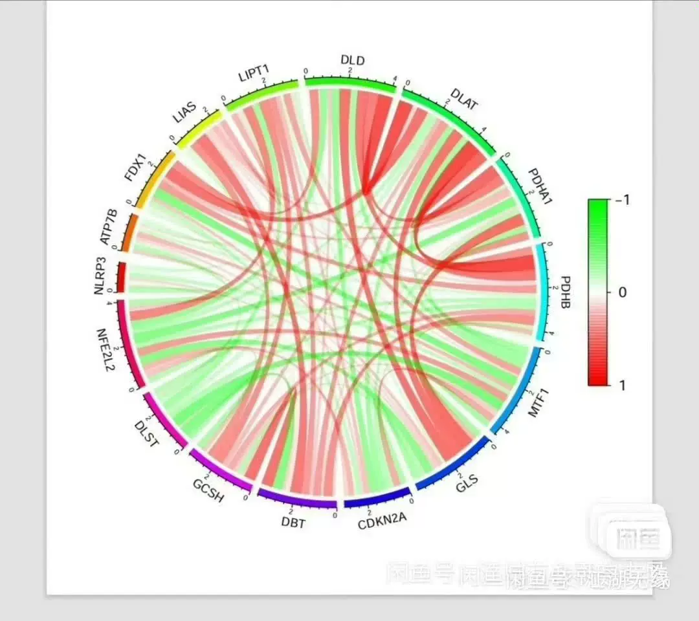
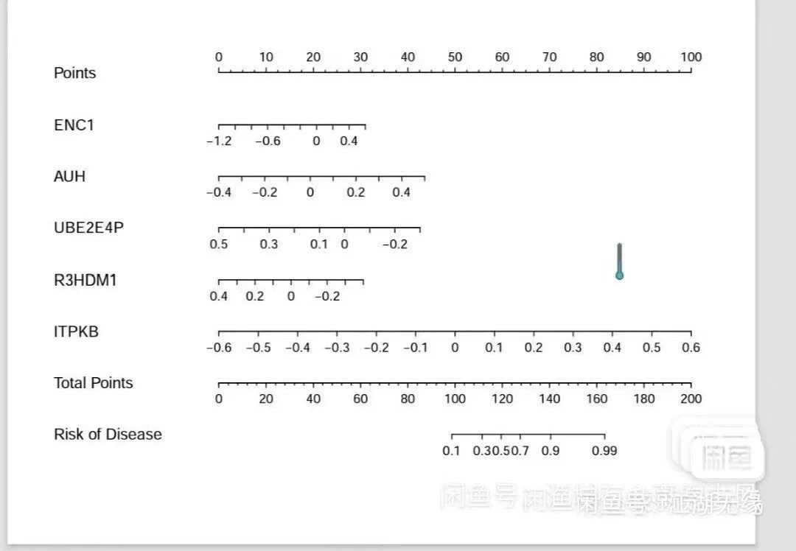

# 【Automatic Delivery】GEO database analysis of non-tumor hotspot gene sets

## Body

Automatic Delivery: Analysis of Non-Oncogenic Gene Signatures in the GEO database
Automatic Delivery: Analysis of Non-Oncogenic Gene Signatures in the GEO database
Automatic Delivery: Analysis of Non-Oncogenic Gene Signatures in the GEO database

【Automatic Delivery】GEO database non-tumor hotspot gene set analysis article
R language genomics analysis full set of code [image] example data [image] video explanation

The code contains the following content:
[image]GEO data download and annotation
[image]Extract gene sets and gene expression levels
[image]Gene set gene differential analysis

[image] Immune cell infiltration
[image] WGCNA co-expression analysis
[image] Sample typing
[image] Typing WGCNA co-expression analysis

Intersection core genes
Construct 9 machine learning models
Screen disease characteristic genes
Line chart

[image] Verify Group Difference Analysis and ROC Curve

This is pure gold, absolutely worth every penny. If you're looking for a reliable source of information, don't miss out!

The content includes practical code data. You can replace your own data, run it, and generate images.
Due to the product's replicability, there is no refund. If you are not comfortable with this, please do not purchase.

The listed price is for file 2, and no Q&A service is provided.

【Note: Purchase automatically shipped, no need to ask more questions, returns are accepted for invalid orders】

## Images

## Payment

Here is a pay link on Stripe ( https://buy.stripe.com/3cs8yP7sY87d0vu9AB ). Please contact me lonlonago@foxmail.com after funding $89, and I will send you a complete data files , thank you!

